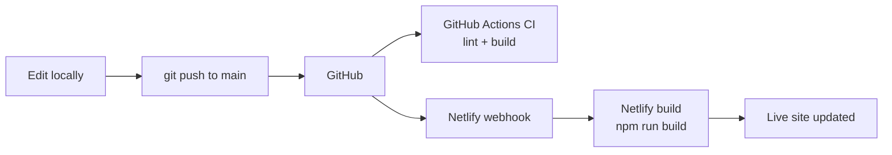

# manoj-portfolio

Personal site built with [AstroNano](https://astro.build/themes/details/astronano/) ([markhorn-dev/astro-nano](https://github.com/markhorn-dev/astro-nano)).

## Local dev

```bash
npm install
npm run dev
```

## Customize

| What | Where |
|------|--------|
| Name, email, socials | `src/consts.ts` |
| Homepage intro (plain text) | `src/content/home/intro.md` |
| Homepage layout (sections) | `src/pages/index.astro` |
| Work history | `src/content/work/*.md` |
| Projects | `src/content/projects/*/index.md` |
| Essays (blog) | `src/content/blog/<slug>/index.md` — copy from `_template/`; see `src/content/blog/README.md` |
| Blog upvotes & comments | Netlify Functions + Blobs (live on deploy; `npm run dev:netlify` locally) |
| Owner / moderation | Set `PORTFOLIO_OWNER_SECRET` on Netlify. Visit any page with `?owner=YOUR_SECRET` once to set an HttpOnly cookie (skips visitor count). Moderation UI: `/owner-dashboard` (Bearer uses same secret; not linked in nav). |
| Visitor count | Footer “Visitors (all time)” — stored in Blobs via `visitors` function. |
| Photo | Replace `public/me.svg` or add `public/me.jpg` and update `index.astro` |
| Resume | `public/resume.pdf` |
| Site URL (sitemap) | `astro.config.mjs` → `site` after Netlify deploy |

## CI/CD (GitHub → Netlify)

Deploy is **continuous**: Netlify watches your repo and rebuilds the site on every push. No manual uploads.



| Layer | What runs | When |
|-------|-----------|------|
| **CD (deploy)** | Netlify | Every push to `main` (and PR previews if enabled) |
| **CI (checks)** | [`.github/workflows/ci.yml`](.github/workflows/ci.yml) | Every push/PR to `main` — fails early if lint/build breaks |

### One-time setup (enables the pipeline)

1. [app.netlify.com/start](https://app.netlify.com/start) → **Import from Git** → GitHub → **`Kill3r-28/manoj-portfolio`**.
2. Confirm build settings match `netlify.toml` (command `npm run build`, publish `dist`) → **Deploy**.
3. **Site configuration → Build & deploy → Continuous deployment** — production branch **`main`**.
4. (Optional) **Deploy contexts** → turn on **Deploy Previews** for pull requests.
5. After first deploy, set `site` in `astro.config.mjs` to your `*.netlify.app` URL and push again.

### Netlify environment (required for engagement + owner tools)

In **Site configuration → Environment variables**, add:

| Variable | Purpose |
|----------|---------|
| `PORTFOLIO_OWNER_SECRET` | Long random string. Same value as `?owner=…` in the URL, `Authorization: Bearer …` for `/owner-dashboard`, and cookie login via `/.netlify/functions/owner-login`. |
| *(auto)* `NETLIFY_SITE_ID`, `NETLIFY_BLOBS_TOKEN` | Injected on deploy when **Netlify Blobs** is enabled for the site. |

Enable **Blobs** for the project (Netlify UI: storage / Blobs — exact location varies by dashboard version). Without Blobs + tokens, functions fall back to read-only or empty storage and upvotes/comments can fail.

Local testing: copy `.env.example` → `.env` and run `npm run dev:netlify` (set `USE_LOCAL_ENGAGEMENT=true` to use `.data/` files instead of Blobs).

### Day-to-day workflow

```bash
# edit files, then:
git add .
git commit -m "Update homepage copy"
git push origin main
```

Within a few minutes: GitHub Actions shows pass/fail; Netlify builds and updates the live URL. Check **Netlify → Deploys** for build logs.

Repo: https://github.com/Kill3r-28/manoj-portfolio

## Theme credit

MIT · [AstroNano by Mark Horn](https://astro.build/themes/details/astronano/)
